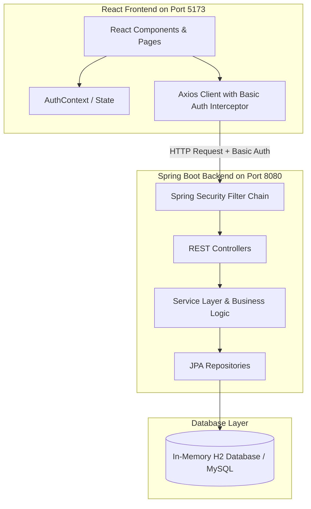
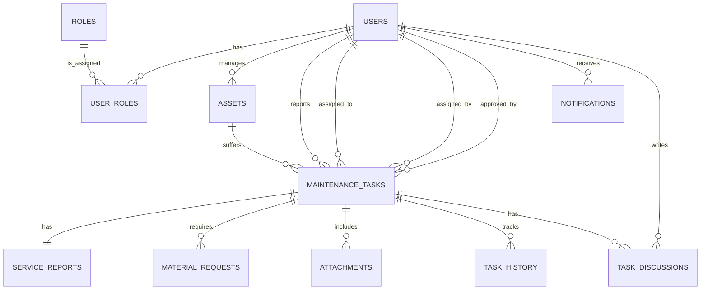
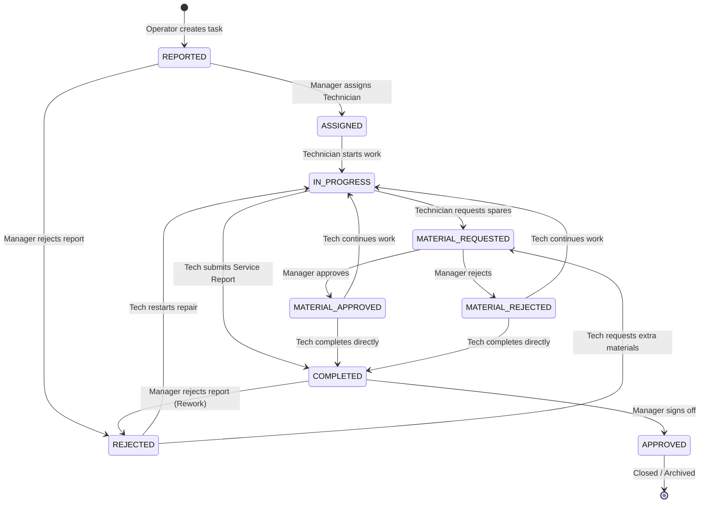

# Asset Maintenance Automation System - Comprehensive Project Guide

Welcome to the comprehensive self-study and learning guide for the **Asset Maintenance Automation System** (Version 1.0). This document serves as your complete manual to understand, revise, run, and master the entire codebase.

You can easily export this guide or the generated `all_code_context.html` file to a PDF by opening it in your browser and selecting **Print -> Save as PDF**.

---

## Table of Contents
1. **System Architecture & Design**
2. **Database Schema & Data Model**
3. **Core Workflow & State Machine**
4. **Security & Authentication Model**
5. **Backend Implementation Details**
6. **Frontend Implementation Details**
7. **Complete Testing Framework Guide**
8. **Local Development & Deployment Commands**

---

## 1. System Architecture & Design

The application is structured as a modern, decoupled full-stack system:



*   **React Frontend (Vite)**: A single-page application (SPA) styled with custom CSS. It renders views dynamically based on the authenticated user's role and intercepts all outbound API requests to attach the base64-encoded HTTP Basic Authentication header.
*   **Spring Boot Backend**: Exposes a RESTful API. Endpoints are secured via Spring Security method-level checks (`@PreAuthorize`).
*   **Database**: Uses H2 for rapid development and testing, automatically seeded with mock machinery and roles on startup.

---

## 2. Database Schema & Data Model

The persistence layer maps relational tables to Java Entities using JPA/Hibernate. The database is seeded automatically by [DatabaseSeeder.java](file:///c:/Users/ARCHIT/Documents/POC_Siemens/Asset%20maintenance%20automation%20system%20design_files/asset-maintenance-system/asset-maintenance/src/main/java/com/example/asset/asset_maintenance/config/DatabaseSeeder.java).



### Entities Description:
1.  **User**: Stores the user's name, email address, password hash, status (Active/Inactive), and recovery/token parameters.
2.  **Role**: Defines system permissions (`ADMIN`, `MANAGER`, `TECHNICIAN`, `USER`).
3.  **UserRole**: Many-to-many relationship mapping table between users and roles.
4.  **Asset**: Represents factory machinery (e.g., CNC Milling Machine, Robotic Welder Arm) containing location, category, manufacturer, and a reference to its manager.
5.  **MaintenanceTask**: The main work order containing task code (e.g., `TSK-XXXX-YYY`), title, description, priority, status, and references to who reported it, who is assigned, and who approved it.
6.  **ServiceReport**: Diagnostic details submitted by the technician upon task completion (root cause, work performed, duration, recommendations).
7.  **MaterialRequest**: Spare parts or tools requested by the technician during repair, which must be approved or rejected by a manager.
8.  **Attachment**: Store path reference and files uploaded during reporting or repair.
9.  **TaskHistory**: Comprehensive audit trail logs tracking actions, transitions (`fromStatus` -> `toStatus`), timestamps, and remarks.
10. **Notification**: Stores real-time or event-driven alerts for users about task statuses and assignments.
11. **TaskDiscussion**: Message/comment logs posted to a maintenance task's timeline for discussion between operators, technicians, and managers.

---

## 3. Core Workflow & State Machine

The core value of this system lies in its strict **Work Order Lifecycle State Machine**, which prevents unauthorized task updates using role checks.



### Allowed Status Transitions (Role-Enforced):
*   **Technician Transitions**:
    *   `ASSIGNED` $\rightarrow$ `IN_PROGRESS`
    *   `IN_PROGRESS` $\rightarrow$ `COMPLETED` (requires submitting a Service Report)
    *   `IN_PROGRESS` $\rightarrow$ `MATERIAL_REQUESTED`
    *   `MATERIAL_APPROVED`/`MATERIAL_REJECTED` $\rightarrow$ `COMPLETED`
    *   `REJECTED` (Manager rework) $\rightarrow$ `IN_PROGRESS` / `MATERIAL_REQUESTED`
*   **Manager / Admin Transitions**:
    *   `REPORTED` $\rightarrow$ `ASSIGNED`
    *   `REPORTED` $\rightarrow$ `REJECTED` (Task request rejected outright)
    *   `COMPLETED` $\rightarrow$ `APPROVED`
    *   `COMPLETED` $\rightarrow$ `REJECTED` (Rejects fix, forces rework)
    *   `MATERIAL_REQUESTED` $\rightarrow$ `MATERIAL_APPROVED` / `MATERIAL_REJECTED`

Rules are evaluated programmatically in [TaskStatusTransition.java](file:///c:/Users/ARCHIT/Documents/POC_Siemens/Asset%20maintenance%20automation%20system%20design_files/asset-maintenance-system/asset-maintenance/src/main/java/com/example/asset/asset_maintenance/service/TaskStatusTransition.java).

---

## 4. Security & Authentication Model

1.  **Transport Protocol**: The application sends a standard base64 `Authorization` header containing credentials (`email:password`) with every HTTP request.
2.  **Basic Filter Chain**: Declared in [SecurityConfig.java](file:///c:/Users/ARCHIT/Documents/POC_Siemens/Asset%20maintenance%20automation%20system%20design_files/asset-maintenance-system/asset-maintenance/src/main/java/com/example/asset/asset_maintenance/config/SecurityConfig.java). It disables CSRF, configures CORS wildcard patterns, and protects all API endpoints except `/users/register`, `/uploads/**`, and `/h2-console/**`.
3.  **Authentication Provider**: Spring Security calls [CustomUserDetailsService.java](file:///c:/Users/ARCHIT/Documents/POC_Siemens/Asset%20maintenance%20automation%20system%20design_files/asset-maintenance-system/asset-maintenance/src/main/java/com/example/asset/asset_maintenance/service/CustomUserDetailsService.java), which loads credentials from the `User` repository and maps user roles into `ROLE_ADMIN`, `ROLE_MANAGER`, etc.
4.  **Method-level Security**: Controllers verify roles using `@PreAuthorize`:
    ```java
    @PostMapping
    @PreAuthorize("hasAnyRole('MANAGER', 'ADMIN')")
    public Asset createAsset(@RequestBody Asset asset, Principal principal) { ... }
    ```
5.  **Hardened Security**: The unsecure "Forgot Password" self-recovery endpoint has been completely removed to prevent unauthorized reset bypasses. Password changes must now be managed securely by administrators.

---

## 5. Backend Implementation Details

*   **Controllers**: Map requests and call services. For example, `AssetController` manages machinery registers; `MaintenanceTaskController` handles task updates, status changes, service reports, and attachment uploads.
*   **Services**: Expose core business logic.
    *   `MaintenanceTaskService`: Implements task creation, technician assignment, status transition rules, attachment file operations, and visibility rules.
    *   `NotificationService`: Saves event logs into the database to notify users (e.g. telling a technician they were assigned a task, or notifying a manager of a new report).
    *   `PdfReportService`: Formats the task details, asset information, service report remarks, and spare parts list into an executive PDF using OpenPDF.

---

## 6. Frontend Implementation Details

*   **Vite React SPA Structure**:
    *   `src/api.js`: Declares the global Axios client instance and sets up request interceptors to automatically fetch the base64-encoded basic authorization credentials from `localStorage`.
    *   `src/context/AuthContext.jsx`: Provides global sign-in, signup, profile loading, and logout states.
    *   `src/components/ProtectedRoute.jsx`: Guarantees only logged-in users with correct roles can view private page elements.
    *   `src/components/Layout.jsx`: Main sidebar and top welcoming header layout. Handles task reporting popups and real-time notification alerts.
*   **Views & Dashboards**:
    *   `Login.jsx`: Secure gateway allowing users to sign in or register a new account.
    *   `Dashboard.jsx`: Parent dashboard router/wrapper that loads the appropriate role-based dashboard component:
        *   `ManagerDashboard.jsx`: Metrics overview, task assignments, and approval actions for requested materials or completed tasks.
        *   `TechnicianDashboard.jsx`: Assigned tasks list, start-work action buttons, and active work orders list.
        *   `OperatorDashboard.jsx`: List of reported tasks, status tracker, and simple quick-actions.
    *   `Assets.jsx`: Lists active machinery configurations in tabular formats.
    *   `TaskDetail.jsx`: Allows users to upload images, write service reports, request spare parts, change states, or post questions to the task's timeline.
    *   `Profile.jsx`: View active profile fields, IDs, roles, and descriptions.

---

## 7. Complete Testing Framework Guide

### Backend Tests
*   **`TaskStatusTransitionTest.java`**: Verifies allowed technician/manager state changes and role constraints.
*   **`AssetServiceTest.java`**: Evaluates Mockito repositories mapping asset code prefixing (`ASSET-<timestamp>`) and retrieval.
*   **`MaintenanceTaskServiceTest.java`**: Asserts priority scheduling rules, assignment logic, security check blockades, and role-based searching filters.
*   **`UserControllerTest.java`** & **`AssetControllerTest.java`**: MockMvc integration tests verifying security access levels, endpoint authorization blocks, and user registrations.

### Frontend Tests
*   **`setupTests.js`**: Integrates standard testing query matchers like `toBeInTheDocument()`.
*   **`ProtectedRoute.test.jsx`**: Validates router guards, redirects unauthenticated users to `/login`, and redirects incorrect roles to dashboard.
*   **`Profile.test.jsx`**: Evaluates layout renderings of authenticated profile data and custom descriptions.

---

## 8. Local Development & Deployment Commands

Use the following commands to execute or compile the project locally:

### Run Backend (Port 8080)
```powershell
cd asset-maintenance
# Start the Spring Boot application
.\mvnw.cmd spring-boot:run
```

### Run Backend Tests
```powershell
cd asset-maintenance
.\mvnw.cmd test
```

### Run Frontend (Port 5173)
```powershell
cd asset-maintenance-frontend
# Install packages
npm install
# Run developer hot-reload server
npm run dev
```

### Run Frontend Tests
```powershell
cd asset-maintenance-frontend
# Run vitest execution once
npm run test -- --run
```

---

## Accessing Full Source Code Context
To examine the exact implementation details of every single file, open the generated [all_code_context.html](file:///c:/Users/ARCHIT/Documents/POC_Siemens/Asset%20maintenance%20automation%20system%20design_files/asset-maintenance-system/all_code_context.html) file in your web browser. 
It bundles the complete system code for easy search, revision, and study.
